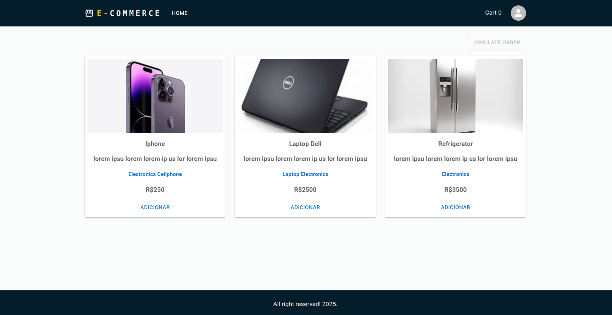
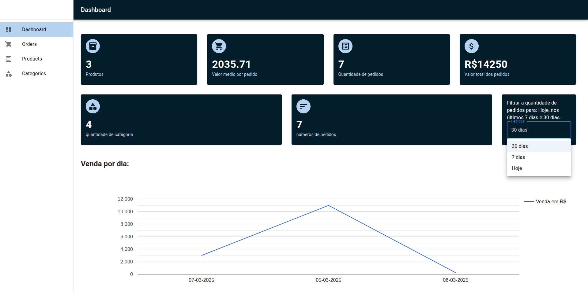
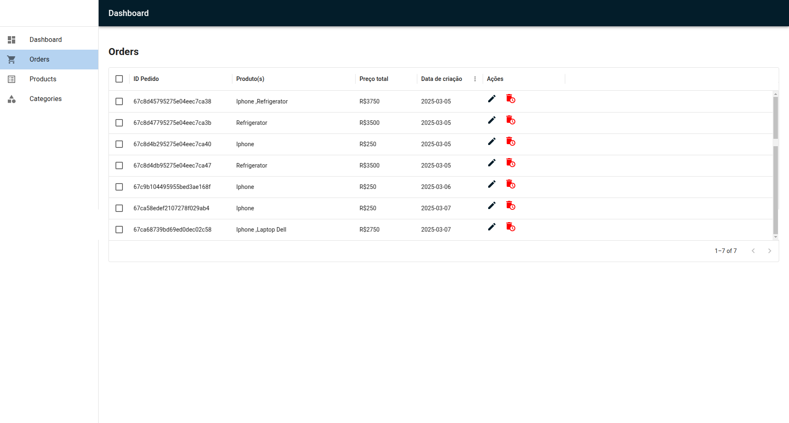
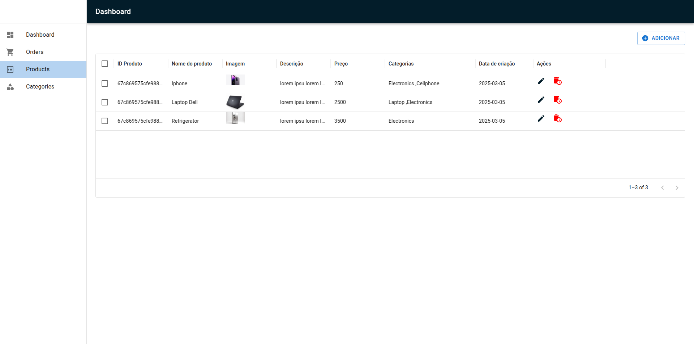
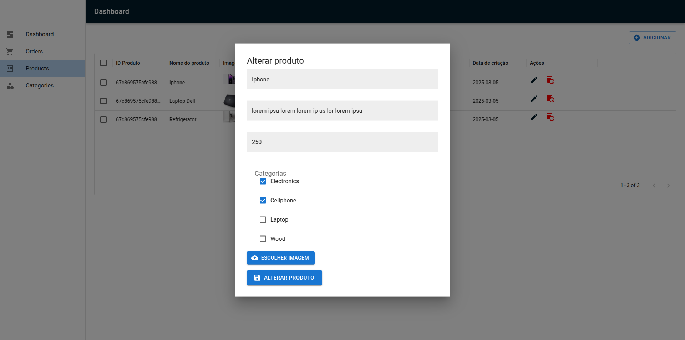
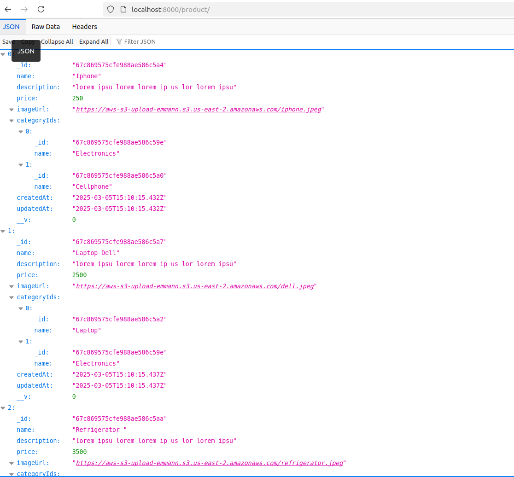
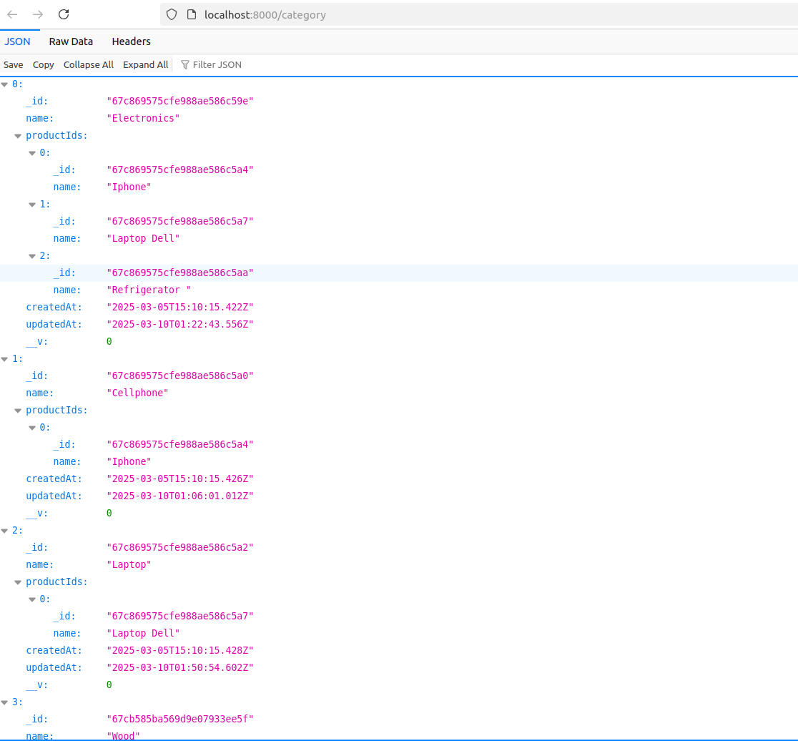

# Mini Projeto de E-commerce

Esse projeto permite de simular orders com um botao no frontend do aplicativo depois adicionar um ou mais produto no carinho de simulacao (o carinho esta usando localStorage para salvar IDs dos produtos; depois a  criacao da ordem, o  localStorage e limpado);


## 3 Entidades

 - Product
 - Category
 -  Order


## Relacionamento
 - Product  & Category : Many to Many
 -  Order & Product: One to Many


## Features (Backend)

- DTOs implementados
- Quando um produto e criado ele e adicionado numa categoria, e essa categoria recebe o ID desse produto.
- na atualizacao de produto, quando acrescentar uma ou mais categorias num produto,
     o ID desse produto vai se cadastrado nas categorias que esse produto pertence.
- Ao deletar um produto, o ID desse produto e delatado em todas as categorias que ele pertence.
-  Ao deletar uma categoria, o ID dessa categoria vai ser deletado em todos os produtos que ele pertence. 
Desta forma, a consistência vai ser mantida.

-  Tratamento de erros e status com um middleware, estrutura de JSON
-    Quando um ordem e criado um evento escutando para cada criacao de ordem para o envio de email com Nodemailer usando o servico de email implementado.
-  O upload de image foi implementado no backend com S3 e gera  um URL salvo com a criacao de novo produto.


## Features (Frontend)

- Material UI
- Validações de formulario com Formik e Yup
- Datagrid para listagem de Produtos, categorias e Ordem.
- Quando editar um produto, poderia acrescentar mais categorias
- Upload de imagem

## Dashboard de KPIs via Mongo DB Aggregation:

- Quantidade total de pedidos
- Valor médio por pedido
- Receita total
- Pedidos por período (diário, semanal, mensal)
- Quantidade de categorias
- Quantidade de categorias
- Venda diaria por dia com datas com grafico


## Tech Stack

**Frontend:** React, Material UI, Formik, Yup, Datagrid, Custom Hooks

**Backend:** NestJs, Express, S3, Mongo DB, Nodemailer, Cors, @nestjs/config

**Ferramenta:** Docker


## API Reference

#### Get all products

```http
  GET /product
```


#### Get single product

```http
  GET /product/${id}
```

| Parameter | Type     | Description                       |
| :-------- | :------- | :-------------------------------- |
| `id`      | `string` | **Required & valid**. Id of product to fetch |


#### Update one  product

```http
  PATCH /product/${id}
```

| Parameter | Type     | Description                       |
| :-------- | :------- | :-------------------------------- |
| `id`      | `string` | **Required & valid**. Id of product to update |


#### Delete one  product

```http
  DELETE /product/${id}
```

| Parameter | Type     | Description                       |
| :-------- | :------- | :-------------------------------- |
| `id`      | `string` | **Required & valid**. Id of product to delete |

#### Populate Product & Category

```http
  GET /product/category/populate
```


#### Get all catgeories

```http
  GET /category
```


#### Get single category

```http
  GET /category/${id}
```
| Parameter | Type     | Description                       |
| :-------- | :------- | :-------------------------------- |
| `id`      | `string` | **Required & valid**. Id of category to fetch |


#### Update one  category

```http
  PATCH /category/${id}
```

| Parameter | Type     | Description                       |
| :-------- | :------- | :-------------------------------- |
| `id`      | `string` | **Required & valid**. Id of category to update |


#### Delete one  category

```http
  DELETE /category/${id}
```

| Parameter | Type     | Description                       |
| :-------- | :------- | :-------------------------------- |
| `id`      | `string` | **Required & valid**. Id of category to delete |


#### Get all orders

```http
  GET /order
```


#### Get single order

```http
  GET /order/${id}
```
| Parameter | Type     | Description                       |
| :-------- | :------- | :-------------------------------- |
| `id`      | `string` | **Required & valid**. Id of order to fetch |


#### Update one  order

```http
  PATCH /category/${id}
```

| Parameter | Type     | Description                       |
| :-------- | :------- | :-------------------------------- |
| `id`      | `string` | **Required & valid**. Id of order to update |


#### Delete one  order

```http
  DELETE /order/${id}
```

| Parameter | Type     | Description                       |
| :-------- | :------- | :-------------------------------- |
| `id`      | `string` | **Required & valid**. Id of order to delete |


#### Upload imagem (We only use upload service inside product)

```http
  POST /upload
```

#### Sending E-mail (We only use email service not the enpoint via event) 

```http
  POST /email
```


## Environment Variables

To run this project, you will need to add the following environment variables to your .env file

`S3_ACCESS_KEY`
`S3_SECRET_ACCESS_KEY`
`S3_REGION`
`S3_BUCKET_NAME`
`EMAIL_HOST`
`EMAIL_USERNAME`
`EMAIL_PASSWORD`


## Installation

Download nest-fullstack Github folder (Should have docker install)

```bash
  cd nest-fullstack
  RUN  docker compose up -d 
```
To build and run images in a container.


    
## Screenshots





















